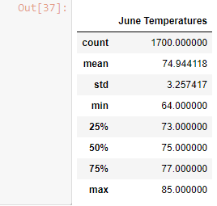
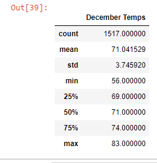

# surfs_up

## Overview
The purpose of this analysis was to gather data on the temperature trends during the months of June and December in Oahu. This data is going to be critical in determining if our surf shop will be sustainable year round. To do this, we used sqlalchemy to query our sqlite database. After gathering our data, we converted it into a dataframe and found the summary statistics. 

## Results
- Firstly, the statistics for the month of June show that it is perfect weather for surfing and ice-cream consumption. A mean temperature of 74.94, with an IQR ranging from 73 to 77 shows that most days are optimal for surf. There are some outliers, as the minimum temperature is 64 degrees, with a maximum of 85. 

- Next, we can see in December that the range of possible temperatures in overall lower. A mean temperature of 71.04 degrees shows that there are definitely still days where the temperature is warm enough to surf and enjoy ice cream. You can also see that the minimum temperature has dropped to 56 degrees (bring a wetsuit!) and the maximum temperature is only two degrees less than during the summer, at 83 degrees. 

- Finally, after seeing the minimum and maximum temperatures for both months, and December's slightly larger standard deviation, we can say that there seems to be a greater variability of temperatures during December. However, there is still likely to be weather conducive to surfing and ice cream eating, judging by December's IQR.

## Summary
Overall, the analysis of our temperatures in June and December was very helpful, and I believe that despite the variability of December's temperatures, it would be possible to open the Oahu Surf Shop year round. The data shows that there are many dates in December that have temperatures similar to that of June, and are conducive to both surfing and ice cream consumption. 

In gathering additional data, I would query the data based on the closest weather substation to the shop, in order to get an even stronger picture of the temperatures on our specific part of the island. I would also take a look at the likelihood of precipitation based on each month. Of course, more precipitation would equal less customers. 